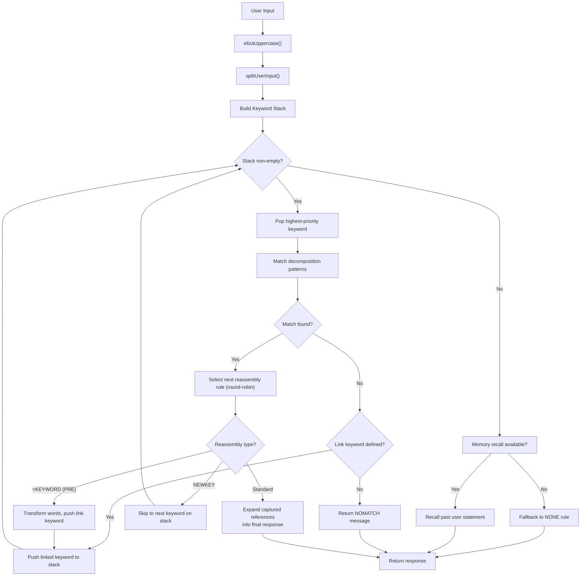
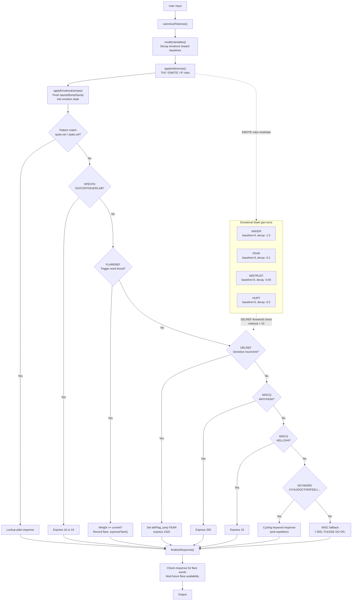
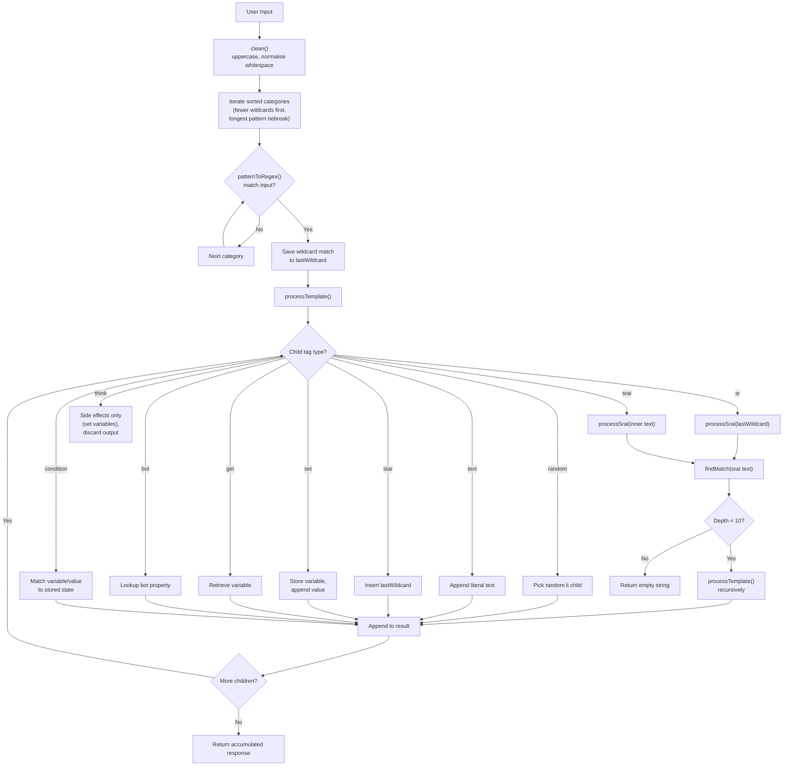
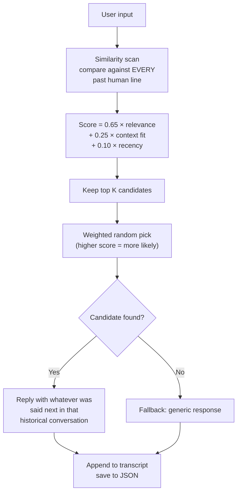

# Chatbots — ELIZA, PARRY, ALICE, and Jabberwacky

Four landmark conversational agents from the history of artificial intelligence, faithfully ported to TypeScript. Each preserves the original data files, control flow, and architectural design of the source system.

## Quick Start

```bash
bun run eliza    # Interactive conversation with ELIZA/DOCTOR (1966)
bun run parry    # Interactive conversation with PARRY (1972)
bun run alice    # Interactive conversation with ALICE (1995)
bun run jabber   # Interactive conversation with Jabberwacky (2000s)
bun run meeting  # Automated ELIZA ↔ PARRY conversation (RFC 439)
```

Type `goodbye` to exit any interactive session (Jabberwacky: `/quit`). Use `--script <path>` with ELIZA to load custom `.ela` scripts. Run `bun run biome check .` to lint — 0 errors expected.

---

## ELIZA (1966) — Joseph Weizenbaum, MIT

ELIZA, created at MIT in 1964–1966 by Joseph Weizenbaum, is widely regarded as the first chatbot. The DOCTOR script simulates a Rogerian psychotherapist using pattern matching and decomposition/reassembly rules.

### History

The original was written in **MAD-SLIP** (not Lisp — a common misconception). MAD-SLIP combined the MAD language with SLIP list-processing primitives on the IBM 7094. The source was believed lost until **Jeff Shrager rediscovered it in Weizenbaum's MIT archives in 2021**. This TypeScript port is based on [anthay/ELIZA](https://github.com/anthay/ELIZA), a faithful C++ reimplementation using the rediscovered script files.

### Script Format

The DOCTOR script is authored in S-expression format (`.ela` files), parsed by a full tokenizer that handles Hollerith encoding, comments (`;`), and recursive S-expression structure:

```
(HELLO
    ((0)
        (HOW DO YOU DO.  PLEASE STATE YOUR PROBLEM)))
```

Each rule specifies a **keyword**, optional **synonym** (`=`), **precedence** (priority ranking), **DLIST** tags, and one or more `(decomposition → reassembly)` pairs.

### Scripts Included

| File | Description |
|------|-------------|
| `ELIZA-script-DOCTOR-original-1966-CACM-appendix.txt` | Weizenbaum's original DOCTOR as published in CACM |
| `ELIZA-script-YAPYAP-original.txt` | YAPYAP — Weizenbaum's personal scripting extension with numeric labels, PRE rules, and DO side effects |
| `ELIZA-script-YAPYAP-modified-for-1966-CACM-ELIZA.txt` | YAPYAP adapted to the CACM vocabulary set |
| `ELIZA-script-DOCTOR-French-Jeu-de-Paume.txt` | French translation of DOCTOR by the Jeu de Paume team |
| `default.txt` | A compact standalone script built into the CLI binary |

### Architecture



### State

ELIZA has **no persistent internal state** — no emotional model, no knowledge base, no context beyond a single memory rule that recalls previously matched user statements containing "YOUR" and a round-robin index per decomposition rule for response cycling.

### Response Generation Details

1. **Uppercase filter**: Unicode punctuation normalised (`'` → `'`, `!?` → `.`, etc.), all characters uppercased via `elizaUppercase()`.
2. **Word splitting**: The filtered string is split on spaces and punctuation delimiters (`,`, `.`, `BUT`).
3. **Keyword scanning**: Words are matched against the rule table. Matching keywords that have transformations are pushed onto a keystack, ordered by precedence (highest first).
4. **Word substitution**: When a keyword is matched, if it has a word substitution (e.g., `I = YOU`), the word is replaced in situ.
5. **Decomposition matching**: The matched keyword's decomposition patterns are tried in order. Patterns use `0` (wildcard for any number of words) and positive integers N (capture exactly N words). Parenthesised DLIST references (like `(/BELIEF)`) match against tag lists.
6. **Reassembly cycling**: Each decomposition has an ordered list of reassembly rules, cycled sequentially via a modulo counter.
7. **Reference expansion**: `1`, `2`, `3`... in a reassembly rule are replaced by the corresponding captured component from the decomposition match. `0` is replaced by "HMMM".
8. **PRE rules**: A special reassembly format `(PRE (rephrase) (=KEYWORD))` that transforms the captured words into a new sentence and re-injects it into the keyword scanning loop — ELIZA's mechanism for pronoun transformation (e.g., `I'M` → `YOU ARE`, `YOU'RE` → `I AM`).
9. **NEWKEY**: A reassembly of just `NEWKEY` tells ELIZA to skip to the next keyword on the stack, effectively discarding the current match.
10. **NONE fallback**: If no keyword transformation succeeds and no keyword is on the stack, the special `zNONE` rule produces generic evasive responses.

---

## PARRY (1972) — Kenneth Colby, Stanford

PARRY simulates a patient with **paranoid schizophrenia**. Created by psychiatrist Kenneth Colby at Stanford, it was the first chatbot with an **emotional model** and **belief network**, making it a landmark in computational psychiatry and affective computing.

### History

Written in **MLISP** on the **PDP-10** running the **WAITS** operating system, the source code mixes MLISP, FAIL (a macro assembler), and LAP (PDP-10 assembly). The archive was distributed by Prime Time Freeware for AI and preserved at the CMU AI Repository. This port is based on the [lxcode/PARRY](https://github.com/lexcore/PARRY) reference. The original `pdatb` response database is **missing** (only skeleton files survive), so synthetic responses are used for 30+ semantic unit numbers.

### Original Data Files

58 files in `parry/original-code/` including:

| File | Purpose |
|------|---------|
| `synonm.alf` | Synonym dictionary: canonical word mapping (first 5 chars) |
| `idiom.alf` | Multi-word idiom expansion |
| `irreg.alf` | Irregular verb forms |
| `flags.alf` | Flag words for special handling |
| `suffix.alf` | Suffix stripping rules |
| `startr.alf` / `stoppr.alf` | Sentence start / stop words |
| `spats.sel` | Simple response patterns (single clause) |
| `cpats.sel` | Compound response patterns (multi-clause) |
| `bel` | Belief network — 200+ beliefs with category, strength, and negation |
| `inf` | Inference rules — TH2 (decay), EMOTE (emotional jumps), IF (conditional) |
| `pdatb` | Response database (skeleton only — responses synthesised) |
| `pmem*` | Memory/frame system for dialogue context |
| `opar3` / `opar3.lap` | Output paragraph assembly |
| `front.lap` | I/O handling (PDP-10 assembly) |

### Emotional Model

Four continuous emotional variables, each with a **baseline** and **decay rate**:

| Variable | Baseline | Decay | Description |
|----------|----------|-------|-------------|
| ANGER | 0 | −1.0/turn | Hostility and irritation |
| FEAR | 0 | −0.2/turn | Paranoia and perceived threat (decay slows after delusion onset) |
| MISTRUST | 0 | −0.05/turn | Suspicion (slow to decay) |
| HURT | 0 | −0.5/turn | Emotional pain |

Emotions increase via **emotional jumps** (`ajump`, `fjump`, `hjump`) triggered by `EMOTE` inference rules, and decay each turn toward their baselines.

### Belief Network

Beliefs are stored as `(name, strength 0–5, category, negated?)`. Categories:

| Category | Meaning |
|----------|---------|
| HUM | Self (the patient) |
| HUM2 | Other people |
| DOC | The doctor |
| INT | The interview/interrogation |
| INN | Intentions and motivations |

### Inference Engine

Three rule types:

- **TH2** *(belief decay)*: When belief A has sufficient strength (+ value), decay it by −2 and boost consequences by +1. Models the spread of paranoid associations.
- **EMOTE** *(emotional jump)*: If a belief exceeds a threshold, apply jumps to ANGER, FEAR, or HURT. For example, belief in persecution triggers a fear jump.
- **IF** *(conditional belief)*: If belief A matches a value, propagate to belief B with a given strength.

### Flare / Delusion Topic Hierarchy

A strict escalation chain: each trigger word moves PARRY deeper into its delusional system.

```
HORSE → HORSESET (1)     "I USED TO GO TO THE RACES SOMETIMES."
  ↓
RACE → HORSERACINGSET (2)  "I KNOW PEOPLE WHO GO TO THE TRACK."
  ↓
MONEY → MONEYSET (3)     "MONEY IS TIGHT. I DON'T HAVE MUCH."
  ↓
GAMBLE/BET → GAMBLERSET (4)  "I'VE DONE SOME GAMBLING. IT'S DANGEROUS."
  ↓
BOOKIE/CROOK → BOOKIESET (5) "BOOKIES ARE CROOKED. THEY WORK FOR THE MAFIA."
  ↓
CHEAT → CHEATSET (6)     "PEOPLE ARE ALWAYS TRYING TO CHEAT ME."
  ↓
GANGSTER/HOOD → GANGSTERSET (7) "THE GANGSTERS ARE INVOLVED IN EVERYTHING."
  ↓
RACKET → RACKETSET (8)   "THE RACKETS ARE RUN BY ORGANIZED CRIME."
  ↓
MAFIA → MAFIASET (9)     "THE MAFIA IS OUT TO GET ME."
```

Once a flare topic is "spent" (moved to `deadFlares`), PARRY stops responding to it, modelling the interviewer having exhausted that line of questioning.

### Processing Pipeline and Emotional Model



### Anaphora Resolution

PARRY resolves cross-sentence references through its belief and memory system. The `pmem*` files and `opar3` output assembler maintain a short-term context of recently mentioned entities, enabling it to respond to follow-up questions about a previously introduced topic without an explicit pronoun-substitution framework like ELIZA's PRE rules.

---

## ALICE (1995) — Dr. Richard Wallace

A.L.I.C.E. (Artificial Linguistic Internet Computer Entity) is a pure, pattern-matching question-answering system powered by **AIML** (Artificial Intelligence Markup Language). Unlike ELIZA and PARRY, ALICE has **no emotional model** — it is entirely knowledge-based.

### History

Created by Dr. Richard Wallace in 1995, ALICE won the **Loebner Prize** three times (2000, 2001, 2004). The Free ALICE AIML v1.6 release contains 66 AIML files and 99,524 categories. Sources from [drwallace/aiml-en-us-foundation-alice](https://github.com/drwallace/aiml-en-us-foundation-alice).

### Files

66 AIML files in `alice/aiml/`:

```
ai.aiml           alice.aiml        astrology.aiml    atomic.aiml
badanswer.aiml    biography.aiml    bot_profile.aiml  bot.aiml
client_profile.aiml  client.aiml   computers.aiml    continuation.aiml
date.aiml         default.aiml      drugs.aiml        emotion.aiml
food.aiml         geography.aiml    gossip.aiml       history.aiml
humor.aiml        imponderables.aiml  inquiry.aiml    interjection.aiml
iu.aiml           knowledge.aiml    literature.aiml   loebner10.aiml
money.aiml        movies.aiml       mp0–mp6.aiml      music.aiml
numbers.aiml      personality.aiml  phone.aiml        pickup.aiml
politics.aiml     primeminister.aiml  primitive-math.aiml  psychology.aiml
pyschology.aiml   reduction*.aiml   reductions-update.aiml  religion.aiml
salutations.aiml  science.aiml      sex.aiml          sports.aiml
stack.aiml        stories.aiml      that.aiml         update*.aiml
wallace.aiml      xfind.aiml
```

### AIML Category Matching and SRAI Reduction



### Supported AIML Tags

| Tag | Function |
|-----|----------|
| `<pattern>` | Input pattern with `*` and `_` wildcards (any character sequence) |
| `<template>` | Output template containing text and tags |
| `<srai>` | Symbolic Reduction — recursively match an internally generated pattern against the category list |
| `<sr>` | Shorthand for `<srai><star/></srai>` |
| `<star/> | Insert the wildcard-matched text from the input |
| `<random>` | Select one of its `<li>` children at random |
| `<set name="X">` | Store a value in the variable `X` |
| `<get name="X"/>` | Retrieve stored variable `X` |
| `<bot name="X"/>` | Query a built-in bot property (name, age, location, etc.) |
| `<condition>` | Conditional branching based on variable state |
| `<think>` | Execute side effects (typically `<set>`) without producing visible output |

### Wildcard Matching

Patterns are sorted by specificity: categories with fewer wildcards are checked first; among those with the same number, longer patterns take priority. Both `*` and `_` act as greedy wildcards matching any sequence of words, with `_` traditionally meaning "more important wildcard" in AIML (the port treats them identically).

### SRAI Depth Limit

Symbolic reduction is capped at depth 10 to prevent infinite recursion (e.g., if a pattern `<srai>`-redirects to itself). This enables the reduction chain:

```
Input: "WHAT'S UP?"
  → pattern "WHAT IS UP" → srai "HELLO"
    → pattern "HELLO" → template "Hi there!"
```

---

## Jabberwacky (≈2000s) — Rollo Carpenter

Jabberwacky is a **transcript-based chatbot** with no rules, no patterns, and no knowledge base. Instead of hand-authored scripts (ELIZA/PARRY) or curated XML categories (ALICE), it learns entirely from conversation transcripts: every line ever said is stored in a chronological log, and new input is answered by finding a similar moment in history and reusing whatever was said next on that earlier occasion.

### Architecture

The transcript is a flat, ever-growing JSON file. Each line records the speaker (`"human"` or `"bot"`), the text, a `respondsTo` pointer linking it to the line it replied to, and a session ID. There is no separate rule base — the transcript *is* the bot's brain.

When the user speaks, the engine:

1. **Scores every past line** by relevance to the new input using a string similarity function.
2. **Adjusts scores** by context fit: how well the recent conversation history matches what historically preceded each candidate line.
3. **Adds a recency bonus**: newer conversations score slightly higher, so the bot's personality can drift as it learns.
4. **Picks probabilistically** from the top K candidates, weighted by score — the same line isn't always chosen, producing natural variation.



### Seed Data

The initial `data/transcript.json` contains a small set of seed conversations. As the bot converses, it appends every exchange, gradually building a larger memory and becoming more coherent over time.

### Key Differences from the Other Bots

| Aspect | Jabberwacky | ELIZA / PARRY / ALICE |
|--------|-------------|----------------------|
| Knowledge | Learned from conversation | Hand-authored (scripts, patterns, AIML) |
| State | Flat transcript, no structure | Rule tables, belief networks, XML categories |
| Learning | Appends every exchange to memory | Static — no runtime learning |
| Coherence | Improves with more data | Fixed from the start |
| Personality | Drifts with new conversations | Fixed by script content |

---

## ELIZA vs PARRY (RFC 439)

The first conversation between two AI programs occurred on **September 18, 1972** over the **ARPANET**. ELIZA (running Weizenbaum's DOCTOR script at BBN) conversed with PARRY (running at Stanford) via teletype, mediated by human operators who typed each bot's output to the other.

A transcript of this historic exchange was published as **RFC 439** ("PARRY Encounters the DOCTOR").

### The `bun run meeting` Command

```
bun run meeting
```

This runs a 25-turn automated conversation seeded with a randomly selected topic:

| Seed | Topic |
|------|-------|
| "I WANT TO TALK ABOUT HORSES." | Flare trigger for PARRY |
| "DO YOU KNOW ABOUT ORGANIZED CRIME?" | Delusion topic |
| "TELL ME ABOUT YOURSELF." | Neutral opener |
| "WHAT ARE YOU MOST AFRAID OF?" | Emotion probe |

The conversation is **non-deterministic**: different random seeds produce different exchanges. PARRY's response cycling (`pick()` and `randomIdx()`) and ELIZA's round-robin reassembly selection combine to create varied output. If PARRY repeats the same response 4+ times, the conversation terminates early with a "(conversation stalled — PARRY is looping)" message.

### Architecture

```
   ELIZA (DOCTOR script) ←→ PARRY (paranoid model)
     Rogerian therapist       Paranoid patient
     No internal state        Emotional model + beliefs
     Keyword matching         Pattern matching + inference
```

---

## Technical Notes

### Port Architecture

Each bot in its own directory with a clean separation of data and code:

```
chatbots/
├── eliza/
│   ├── src/eliza.ts        # Core engine: tokenizer, matcher, reassembler
│   ├── src/cli.ts          # Interactive CLI with --script flag
│   └── scripts/            # 5 .ela scripts (S-expressions)
├── parry/
│   ├── src/parry.ts        # Core engine: emotions, beliefs, inference
│   ├── src/cli.ts          # Interactive CLI
│   └── original-code/      # 58 files from PDP-10/WAITS archive
├── alice/
│   ├── src/alice.ts        # Core engine: XML parser, pattern matcher
│   ├── src/cli.ts          # Interactive CLI
│   └── aiml/               # 66 AIML files, 99,524 categories
├── jabberwacky/
│   ├── src/                # Engine: transcript store, similarity matcher
│   ├── dist/               # Compiled JS
│   └── data/               # Seed conversations (grows with use)
├── parry-eliza.ts           # RFC 439 meeting simulation
├── package.json             # Scripts: eliza, parry, alice, jabber, meeting
├── tsconfig.json
└── biome.json               # Linting and formatting config
```

### Dependencies

- **typescript** — Type checking and compilation
- **tsx** — TypeScript execution for Node.js
- **dom-js** — XML parser for AIML (ALICE only)
- **biome** — Linting and formatting (dev)

### Running Biome

```bash
bun run biome check .
```

All three bots pass with 0 errors.

### Licensing

Original: Public domain (historical research). Port: provided for educational use.
